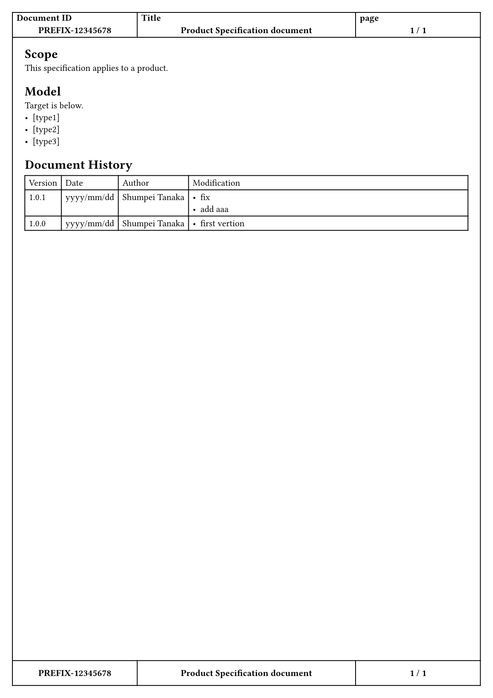
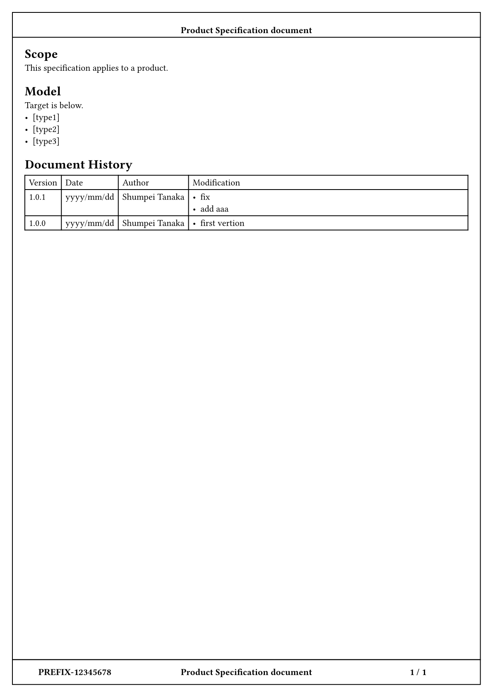
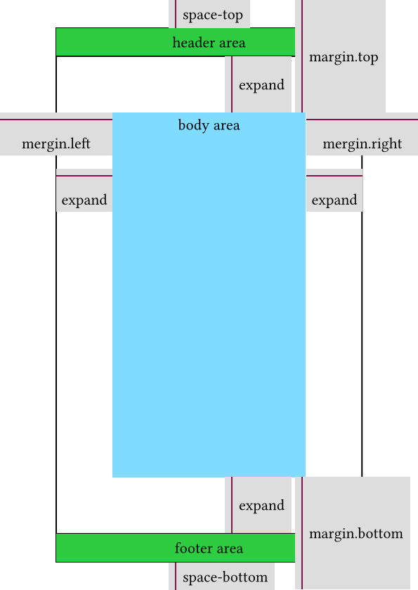

<a name="readme-top"></a>

<!-- Project Shields -->

[![GitHub release (latest SemVer)][release-shield]][release-url][![GitHub License][license-shield]][license-url]

[![Paypal][Paypal-shield]][Paypal-url][![BuyMeACoffee][BuyMeACoffee-sheild]][BuyMeACoffee-url]

<!-- Project Logo -->
<br />
<div align="center">
  <a href="https://github.com/Shumpei-Tanaka/typst-pagebordering">
    
  </a>

  <h3 align="center">pagebordering</h3>

  <p align="center">
    Way to write border around page margin and header/footer.
    <br />
    <a href="https://github.com/Shumpei-Tanaka/typst-pagebordering/issues">Report Bug</a>
    ·
    <a href="https://github.com/Shumpei-Tanaka/typst-pagebordering/issues">Request Feature</a>
  </p>
</div>

<!-- Table of Contents -->

1. [About The Project](#about-the-project)
2. [Demo](#demo)
    1. [Page border include table header/footer](#page-border-include-table-headerfooter)
    2. [Page border exclude header/footer](#page-border-exclude-headerfooter)
    3. [Page border include header/footer](#page-border-include-headerfooter)
3. [Usage](#usage)
4. [Following Rules](#following-rules)
5. [Contributing](#contributing)
    1. [How to contributing](#how-to-contributing)
6. [License](#license)
7. [Contact](#contact)
8. [Say Thank You](#say-thank-you)

## About The Project

Way to write border around page margin and header/footer.

It is often required in business scene.

<p align="right">(<a href="#readme-top">back to top</a>)</p>

## Demo

### Page border include table header/footer


### Page border exclude header/footer


### Page border include header/footer



<p align="right">(<a href="#readme-top">back to top</a>)</p>

## Usage

This package provide a function: `pagebordering`.

import / setting script is shown below.

```
#import "@preview/pagebordering:1.0.0": pagebordering
#show: pagebordering.with(
  page-args: (
    margin: (left: 30pt, right: 30pt, top: 60pt, bottom: 60pt),
  ),
  expand: 15pt,
  space-top: 15pt,
  space-bottom: 15pt,
  strokeHeader: none,
  strokeFooter: none,
  header: "",
  footer: "",
)
```

`page-args` is passed in `page()` function.

`page-args.margin` must to be dictionary include 4 direction.

`header` and `footer` is called outside of `page()`.

You can define like `#let header = [element]`, `#let header = {calls}`.

`strokeHeader` and `strokeFooter` is used to config stroke border around header/footer.

`margin`, `space-top`, `space-bottom` and `expand` works like below.



<p align="right">(<a href="#readme-top">back to top</a>)</p>

## Following Rules

This repository follows below rules.

-   [Github-Flow][github-flow-url]
-   [Semantic Versioning][semver-url]

<p align="right">(<a href="#readme-top">back to top</a>)</p>

## Contributing

Any contributions you make are **greatly appreciated**.

If you have a suggestion that would make this better, please fork the repo and create a pull request. You can also simply open an issue with the tag "enhancement".
Don't forget to give the project a star! Thanks!

### How to contributing

1. Fork the Project
2. Create your Feature Branch (`git checkout -b AmazingFeature`)
3. Commit your Changes (`git commit -m 'Add some AmazingFeature'`)
4. Push to the Branch (`git push origin AmazingFeature`)
5. Open a Pull Request

<p align="right">(<a href="#readme-top">back to top</a>)</p>

## License

The source code is licensed MIT. See [LICENSE][license-url].

<p align="right">(<a href="#readme-top">back to top</a>)</p>

## Contact

-   Shumpei-Tanaka
    -   s6.tanaka.pub@gmail.com
    -   [S6T5: My Homepage][s6t5-url]

<p align="right">(<a href="#readme-top">back to top</a>)</p>

## Say Thank You

If my works feels you helpful, I would be happy to have your support for me :D

links are below.

-   [https://www.paypal.me/s6tanaka][Paypal-url]
-   [https://www.buymeacoffee.com/s6tanaka][BuyMeACoffee-url]

[![Paypal][Paypal-shield]][Paypal-url][![BuyMeACoffee][BuyMeACoffee-sheild]][BuyMeACoffee-url]

<p align="right">(<a href="#readme-top">back to top</a>)</p>

<!-- Markdown Links & Images -->

[release-shield]: https://img.shields.io/github/v/release/Shumpei-Tanaka/typst-pagebordering?style=flat-square&sort=semver
[release-url]: https://github.com/Shumpei-Tanaka/typst-pagebordering/releases/latest
[license-shield]: https://img.shields.io/github/license/Shumpei-Tanaka/typst-pagebordering?flat-square
[license-url]: /LICENSE
[contributors-shield]: https://img.shields.io/github/contributors/Shumpei-Tanaka/typst-pagebordering.svg?style=flat-square
[contributors-url]: https://github.com/Shumpei-Tanaka/typst-pagebordering/graphs/contributors
[forks-shield]: https://img.shields.io/github/forks/Shumpei-Tanaka/typst-pagebordering.svg?style=flat-square
[forks-url]: https://github.com/Shumpei-Tanaka/typst-pagebordering/network/members
[stars-shield]: https://img.shields.io/github/stars/Shumpei-Tanaka/typst-pagebordering.svg?style=flat-square
[stars-url]: https://github.com/Shumpei-Tanaka/typst-pagebordering/stargazers
[issues-shield]: https://img.shields.io/github/issues/Shumpei-Tanaka/typst-pagebordering.svg?style=flat-square
[issues-url]: https://github.com/Shumpei-Tanaka/typst-pagebordering/issues
[Paypal-shield]: https://img.shields.io/badge/paypal.me-s6tanaka-white?style=flat-square&logo=paypal
[Paypal-url]: https://paypal.me/s6tanaka
[BuyMeACoffee-sheild]: https://img.shields.io/badge/buy_me_a_coffee-s6tanaka-white?style=flat-square&logo=buymeacoffee&logocolor=#FFDD00
[BuyMeACoffee-url]: https://www.buymeacoffee.com/s6tanaka
[github-flow-url]: https://docs.github.com/en/get-started/quickstart/github-flow
[semver-url]: https://semver.org/
[s6t5-url]: https://shumpei-tanaka.github.io/
